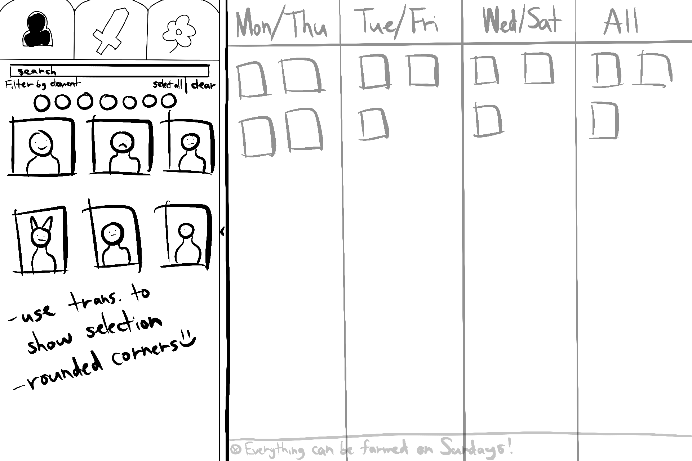
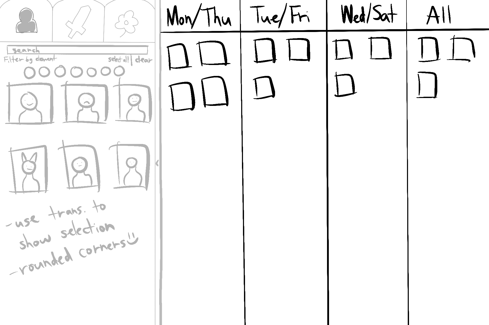

# Questions
## 1. A brief description of what you created, and a link to the project itself (two paragraphs of text)

Players of the open-world action RPG Genshin Impact often find themselves wondering which materials they need to collect (or "farm") based on the day-of-the-week schedule and the particular characters, weapons, or artifacts they wish to improve. Rather than spending hours looking up guides, farming locations, and farming schedules, we compiled a web-based application that easily creates a schedule for players to reference. All they need to do is select the characters, weapons, and/or artifacts they wish to farm.

For context, in Genshin Impact, the player can enhance the strength of characters they own by using certain materials. Each character has their own unique set of materials that must be obtained from the world from defeating enemies around the environment. Weapons, meanwhile, can be equipped by characters, but also have their own set of materials. Artifacts can also be equipped by characters, but they are obtained through farming (note that, while all artifacts are farmable on all days, it is still important to remind players of which artifacts they were hoping to farm). Certain materials are only available on specific days of the week, so we created an application that will help a player organize and remember what materials they need.

LINK: (linkhere)[linkhere]

*REMEMBER: Excellent projects typically serve someone/some group; for this assignment you need to define your users and stakeholders. I encourage you to identify projects that will have impact, either artistically, politically, or in terms of productivity.*

## 2. Any additional instructions that might be needed to fully use your project (login information etc.)

- In order to save your preferences across instances of the program, you must be logged in.  A user can log in using github and this will cause the application to back up the user's preferences into the database.

## 3. An outline of the technologies you used and how you used them.
- **React**:
We utilized React components to create abstract, easily-recyclable components which leverage React states and effects for a web of interconnected functionality. By utilizing a Route-Component model, different components of the application interact with the main route to invoke and read from shared data across the webpage.
- **MongoDB**:
MongoDB provided us an external data source for data preservation for logged-in users (using GitHub OAuth). This allowed us to save user preferences and selections for easy reuse of the program.
- **Express**:
Express provided a simple server solution for serving the application, which allowed us to leverage middleware for many purposes, such as GitHub OAuth logins, MongoDB database connections, as well as the serving of static data and views.
- **TypeScript**:
TypeScript was the first time for many of our team to experiment with typed data in the place of JavaScipt's weakly-typed language. It provided a rigid, consistent structure which provided a guide to how data loaded from the API and DB may be interacted with and used.
- **[Genshin Impact API](https://github.com/bongikairu/genshin-farming-database)**:
A traditional web-based API was difficult to find, so we ended up using the static json data provided by this repository to provide the data we needed locally. This choice meant we had to interact with the foreign library to integrate the data it provided with our own, as well as relate the relevant images to that data.

## 4. What challenges you faced in completing the project.
- **Database**: 
Having the application sync data between a user's session and the database was challenged due to the nature of how react loads components.  We kept running into an issue where the component would updateDB before the users preferences could get loaded from the db, causing the database to be wiped.  We remidied this by using a loading state that would utilized through the application to load data.

- **Data Syncronization**: 
Pressing the toggleable buttons on our project was not updating the calendar without refreshing the webpage.  We overcame this issue by using temporary arrays and react state setter function and using useEffect to look for updates in these arrays.

- **TypeScript/TSX**: 
This was the first time most of the team utilized react and typescript.  This was a big learning curve that slowed down our progress in the early stages of development.  Through more exposure to the technologies we were able to create an application in Typescript and React; however learning the use of types, states, and props presented a challenge for our team.

- **API**: 
Finding an API that contained the information we were looking for along with being up to date proved challenging.  We overcame this by finding json files with up to date data.  We still had to debug issues with the json found [online](https://github.com/bongikairu/genshin-farming-database) as it referenced files we did not have access to.

- **Formatting**:
Our UI Team was tasked with fitting a lot of information into a screen and making that information easy to understand, easy to use, and ultimately appealing to the user. To improve our UI/UX, the UI team created mockups that the rest of the team looked into and voted on a design that best portrayed the information.

## 5. What each group member was responsible for designing / developing.
### Andrew (Backend/Database/React Development):
- As the main developer of the Database, I was responsible for the full stack implementation of user preferences (minus setting preferences through UI).
- I also was responsible for the development of a login system using GitHub OAuth, Passport.js, and React.
- Once these features were implementing I assisted the rest of the team on development of various tasks.  This included
    - Developing the Farming Display in React.
    - Debugging the API
    - Filtering the API and returing a list of farmables and farming locations based on the users currently selected artifacts, weapons, and characters, along with displaying that in the Farming Display components.
    - Working with teamates to fix Data Syncronization issues

### Nick (Backend/React Development)
As a backend & react developer, I was responsible for assembling structure and logic on which others' code relied. This included:
- Providing skeletal framework and identifying how independent members' work would integrate into the project to deliver a final project.
- Organizing and programming a solution for how data updated in the selection-based components (CharacterSelect, WeaponSelect, ArtifactSelect) could then be used by display-based components.
- Organizing and implementing a solution for how database and API datatypes interacted via the Pref (user selections and preferences) and Prop (static data properties) interface and class system.
- Creating SelectPrefButton primitive components to allow for the use of generic types in setting Character, Weapon, and Artifact preference data through selection, such that a single, flexible React component would work for these distinct purposes while allowing UI to display any content within SelectPrefButtons.

### Errica
As a frontend-focused developer, I primarily ensured the site itself was easy to read and easy to use. Some of my tasks included the following:
- Drawing mockups for overall site layout so the team could have a visual reference (especially when deciding on calendar format)
- Implementing preliminary menu flyout functionality
- Choosing and retrieving relevant images & adjusting their names in a way to make them easily accessible to the backend
- Stylizing farming calendar display
- Stylizing selectables in menu display

### Michael

### Matthew (Frontend/Middleware)
As a frontend and middleware developer, I worked on helping design the website and worked on some of the site's functionality. This includes:
- Helping with mockups of overall website layout
- Adding functionality to the menu to help with its opening and closing capabilities
- Added tabs to the menu to store the menu's content
- Worked with implementing other react components to display in the different tabs' content
- Stylizing the tabs in the menu display

6. A link to your project video.
// TODO: Team !!!
