# G3P Expense Tracker

### Yihong Xu

[https://a5-gp2p.glitch.me/](https://a5-gp2p.glitch.me/)

This is an iterated version of my A3 project which is an online expense tracker for users that want the least disturbing and more peace of mind.

## Features:

1. **Indexed Data:** Reading of data from this website is optimized to only take logarithmic time. Information stored on the database are indexed with a B-tree data structure (a self-balancing tree that maintains sorted data and allows searches, sequential access, insertions, and deletions in logarithmic time). This is implemented by configuring mongoDB's indexing feature. The following queries are optimized with indexes:
	1. User login and account creation
	2. Viewing of transactions based on date, sorted by date
	3. Searching of transactions based on content
2. **Global Search:** Users can use the searchbar to search for each of their transaction's note content (including its tag). Searching is optimized and indexed, results are sorted by relevance and date. Specific functionalities include:
	1. Searching for a word - search `coffee` to get results which the note section contains the word "coffee" and similar words like "Coffee" and "coffees"
	2. Searching multiple words - search `coffee candy bar` to get results which the note section contains either the word "coffee" or "candy" or "bar", or any of their similar words, or any combination of it.
	3. Searching multiple words as a phrase - search `"coffee candy bar"` to get results which the note section contains the phrase "coffee candy bar" or its similar phrase like "coffee candy bars".
	4. Searching for a word and excluding another - search `coffee -shop` to get results which the note section contains the word "coffee" and its similar words, but does not contain the word "shop" or its similar words.
3. **Tags:** Users can enter words that start with a `#` to enter a tag for that transaction. Tags will be underlined and clickable. Clicking on a tag will show the user other transactions with the same tag.
4. **View by Selection:** View transactions according to date range selection
5. **View all times:** View transaction of all times
6. **Statistics of selection:** Top of page shows statistics of current filter
7. **Main Page Content Update:** No need to reload the page to get new data anymore
8. **Sample/Random Data/Noun+Tag Generator:** Register an account with specific strings to generate sample/random data/noun+tag in account. See below for details.
9. **Performance Benchmarking Tool:** every load time recorded in the console, along with count and calculated average. Updates once every "enter" hit.
10. **Faster:** Optimized overall response times in various ways, including a complete overhaul to data structure and building indexes for querying and searching.
11. **UI/UX Improvements:** See details below

## Sample Accounts:

### Small, everyday sample data

To get an account with sample data, register an account with its email containing `rv89uj4fui678fwgt3`.

### Huge, 10 years of heavy use worth of random data

I made a random data generator in the server to test indexing performance. To get a not indexed account, register one with its email containing `89jv4hu8283e4c9h`. To get an account with random data, register an account with its email containing `ebdrfcgtvy567u`. Sample accounts are already made: `random@test.yesIndex` and `random@test.noIndex`, passwords are both `1`. Random data represents data amount for a heavy user that have used this website daily for 10 years (2011-2021), and each day averaged to create ~5 transactions with each one having a note of ~18 characters and transaction amount of ~4 digits (two on each side of the decimal point).

### Huge(r), 10 years of heavy use worth of random nouns in notes and as tags (recommended)

I made a random noun+tag generator in the server to test search indexing performance (and tag searching performance). To get an account with random data, register an account with its email containing `kmocowiamcwaiom`. Random nouns represents data amount for a heavy user that have used this website daily for 10 years (2011-2021), and each day averaged to create ~5 transactions with each one having a note of 4 nouns (2 of which are tags) and a number tag, with transaction amount of ~4 digits (two on each side of the decimal point).

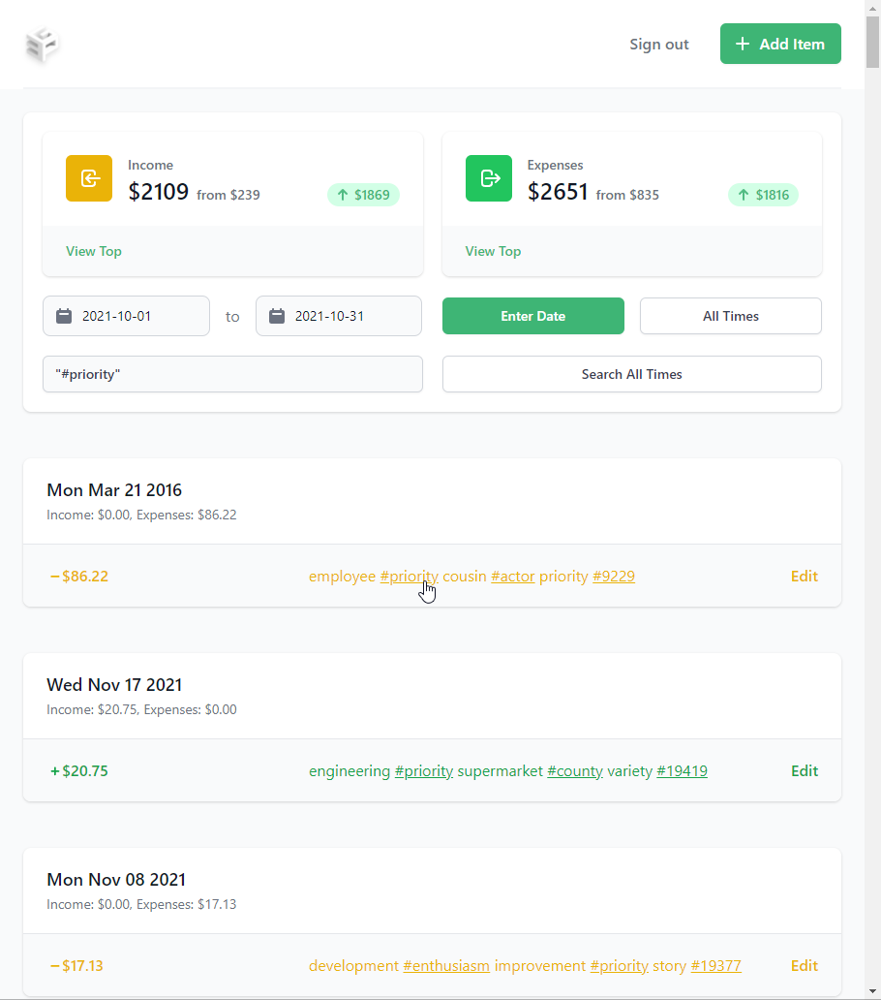

## Performance Benchmarking

CPU: i9-9900KS, Memory: 32 GB, server hosted locally.

### All data

Loading dates `0000-00-00` to `9999-99-99` (19676 generated transactions) data from account `random@test.666`, password `666`

Indexed:

- Took 177 seconds with both side sorting
- Took 188|175 seconds with local side sorting
- Took 167|168 seconds with database side sorting (Extremely consistent load time!?!?)
- Took 172 seconds with no sorting

Not Indexed:

- Took 164 seconds with database side sorting

This shows that indexing does not provide a great performance boost compared to not having indexing on when querying the entirety of the database. After testing this, I added a query length limit of 2000 transactions. Still big but much better than a ~20000 list that could break user experience.

### Part data

Loading dates `0000-01-01` to `2015-01-01` (7380 of 19941 generated transactions) data from account `random@test.123`, password `123`

Indexed:

- Took 27 seconds with both side sorting
- Took 28 seconds with local side sorting
- Took 28 seconds with database side sorting
- Took 27 seconds with no sorting

Not Indexed:

- Took 29 seconds with both side sorting
- Took 28 seconds with local side sorting
- Took 27 seconds with database side sorting
- Took 28 seconds with no sorting

This shows that indexed database side sorting also have little performance effect for querying 37% of the data

### First Page

For this, I made a benchmarking tool that would count starting from the client start processing the request to send to the server, to receiving all data sent back from the server and going over each to generate the day-item structure. This does not include making DOM changes, so it will stop prior to the page finish updating.

Loading dates `2021-10-01` to `2021-10-31` (start page, only ~1/120 of the 19941 generated transactions) data from account `random@test.123`, password `123`

Indexed:

- Took 525.0 milliseconds on average to load with both side sorting
- Took 529.3 milliseconds on average to load with local side sorting
- Took 519.3 milliseconds on average to load with database side sorting
- Took 514.6 milliseconds on average to load with no sorting

Not Indexed:

- Took 534.8 milliseconds on average to load with both side sorting
- Took 543.6 milliseconds on average to load with local side sorting
- Took 534.3 milliseconds on average to load with database side sorting
- Took 526.5 milliseconds on average to load with no sorting

This shows that when querying small data set from the entire database, indexed queries are effective and can reduce 12.75 ms of loading time on average for querying ~1/120 of ~20000 transactions.

## Develop Notes:

### Search

Search is performed on the server side and is optimized (indexed) for speed.

Search results are sorted by relevance, discarding time:

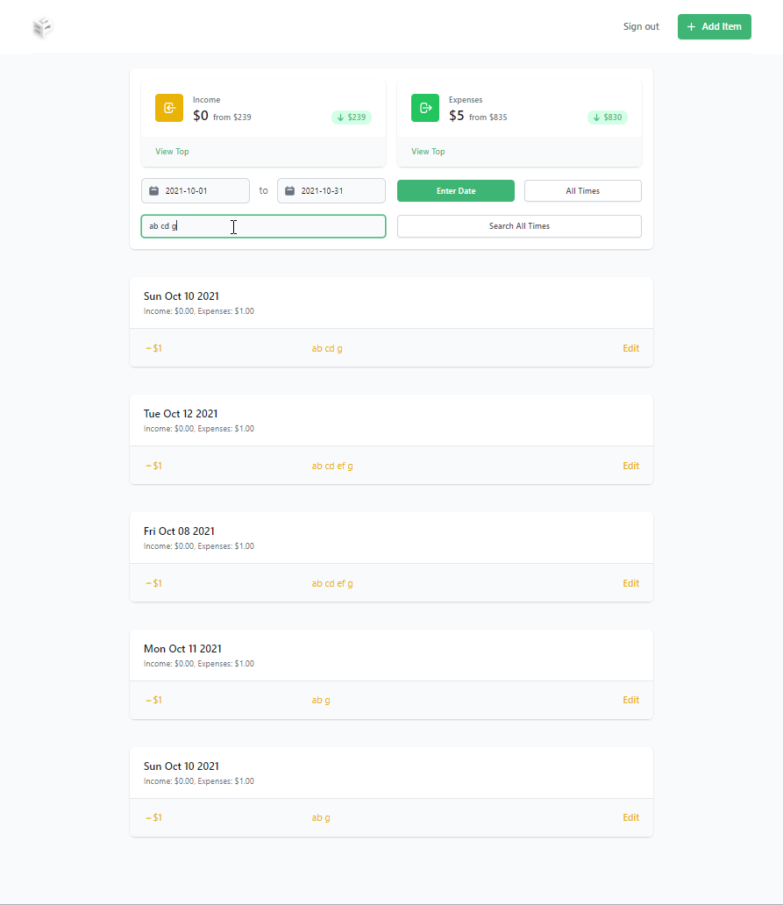

Words can be connected to act as one word with `""`:

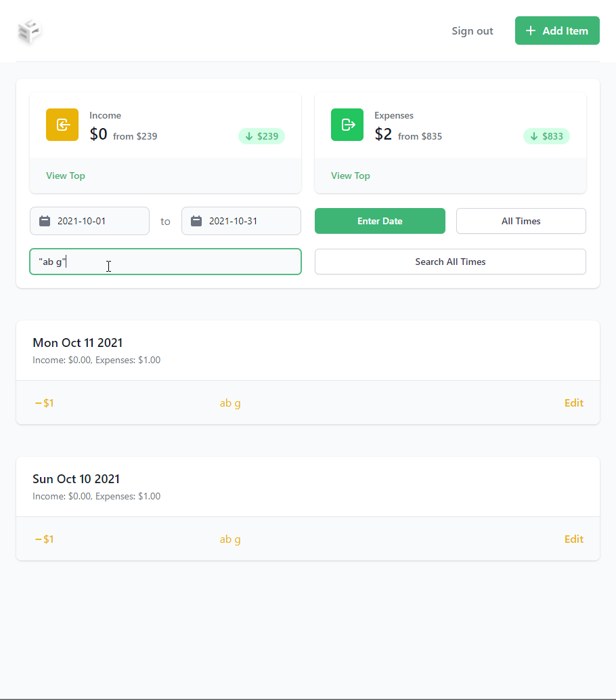

### Tags

Users can enter a word starting with a `#` to mark it as a tag. When displayed, tags are clickable and clicking a tag searches on the server of all other items marked with that tag.

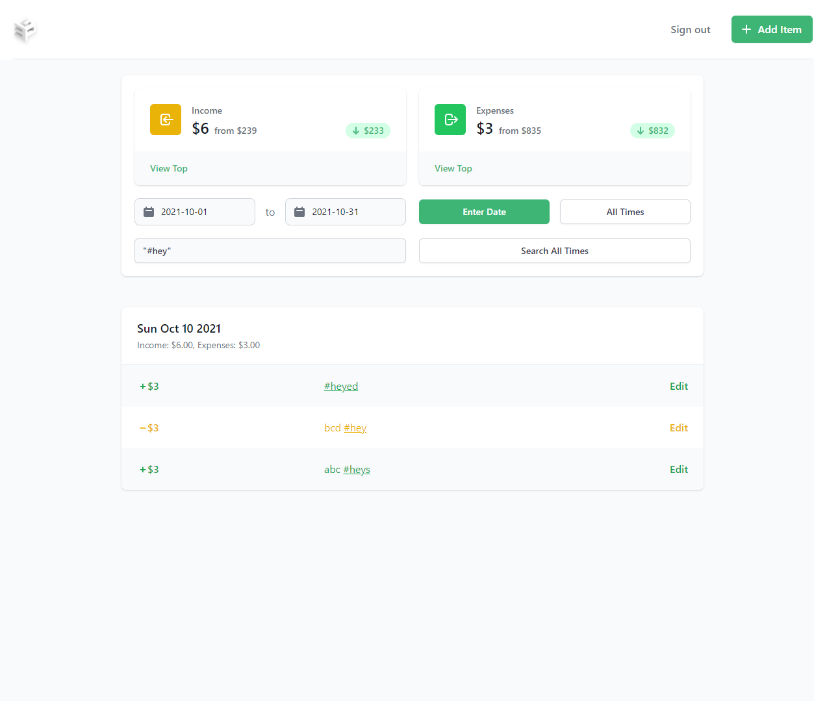

### Data structure, where computation happens, and what gets sent

I was using an embedded document pattern, which is not an efficient way to store in mongoDB when the data set grows large per user (document). Ideally, I should have a collection for a user instead of a collection for an app.

Now I wanted to optimize load time by reducing the network usage between mongoDB and the Node.js server since it's sending all of a user's document's data to the server (for example, only transmit data that are relevant when only showing transactions happened in a timeframe, or searching for a specific transaction), but mongoDB seems to always return the entire document instead of only the sub-documents that satisfies the filter.

I could restructure the project and have each transaction be a document and every user's documents are still stored in the app's collection, but that way querying for all of a user's document requires going through the entire database. Since there is only one level of efficient document management (the document level, under the collection level, above the sub-document level, is what can be returned atomically), I decide that computation for filtering either happen on the Node.js server side or the client side.

I could restructure the project and have each transaction be a document each user will be one collection, but that might disable the app from being accessed by different users at the same time. I did not investigate that very much.

Since novel client devices are very powerful for that level of computation but sending all the files down the pipe just to be sorted/filtered on the client side may lag up the loading. There don't seem to be one single conclusion, but I decided that I will make filtering computations happen on server side to reduce network usages between server and client, and sorting computations on client side to save server computation.

Update: I have looked more into the feasibility of having each user occupy a collection. Since someone compares mongoDB collections as SQL tables, I am going to implement that instead. I will have a collection that is always connected as the table to store users and their information, and create a collection when a user is created.

Update: I finished refactoring the server code from one collection for all users to one user per collection. Got rid of a lot of chunky code resulted from embedded array of objects. It's much fresher to be able to use the driver's native functions instead of using `updateOne()` for everything.

Update: Feels like this change is well worth it, just like some other decisions previously. It has already made it much easier to do things (and more secure since some data isn't passed around), not to say it will sort and filter the data for me in the future.

### UI/UX Stuff

I noticed a set of arrows on the number input field that overlaid with my nice looking inline expense/income selector. Realized they are spinners and finally eliminated them by changing the pre-compile tailwind CSS file. I also restructured the add/edit popup, so they look more natural and balanced. I also looked up how to get the delete button to be on the left instead of right with cancel/edit, and it turns out nice. I also fixed an issue where the popup is positioned near the end of the screen on mobile devices.

Before:
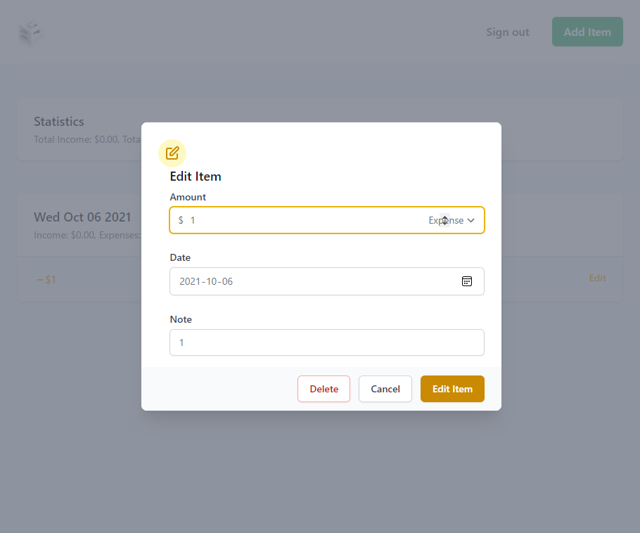
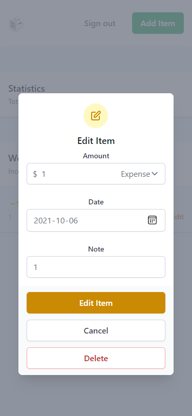

After:

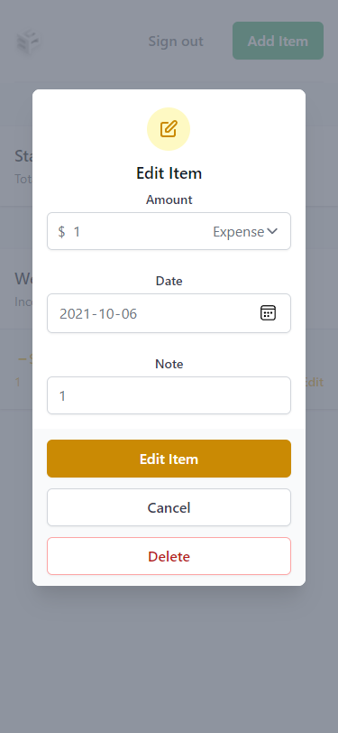

### Main page content refresh

I want the page's content to be changeable without reloading, so I can implement view by timeframe, sort by amount, and the #tag system. To do this, I make the js clear all the page's data on next load and refills it with new data retrieved from the server. When loading, the date picker stays so when an empty selection was made and the screen shows an empty indicator, the user can still switch to use another filter.

#### Date Range Picker

I was trying to find a good time range picker for the page and finally came upon `tailwind-datepicker` (which I later realize is a fork of another package called `vanillajs-datepicker`). But it turns out not working, and I had to solve many issues. It was asking for type module which disallows other Node.js dependencies to work. The import string from its website is actually incorrect or unusable (missing /js/ folder before js file, and missing .js extension of file). After I corrected the string I had to make the server serve the files for the client site to use this node package, good thing it does not use more dependencies. After that it still shows randomly, and I realized my purgeCSS did not add the parts in node_modules to the whitelist, it took me some more time to figure out a simple fix. Then I went to the initial project's demo site and configured the options I wanted, I have to say it is very customizable and looks really mature.

#### New Statistics Bar

The stats bar needs to change to work with the date range picker, and it has to be more beautiful and useful

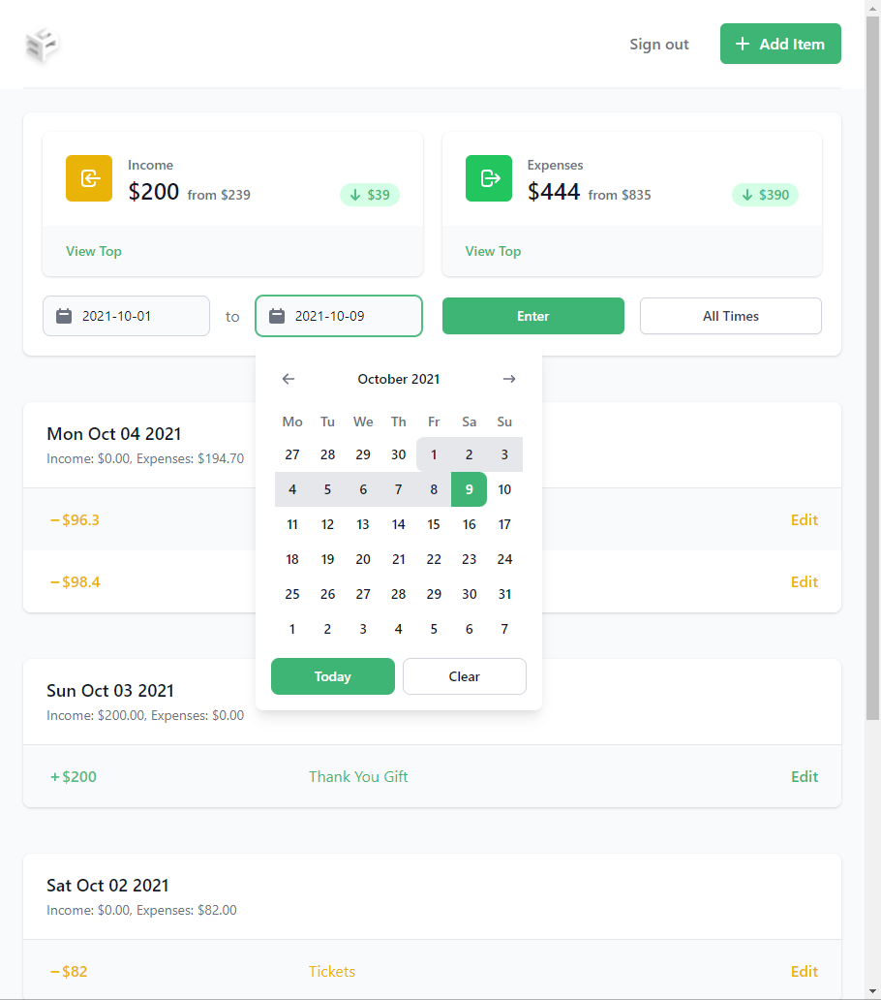

#### Loading... Wow, such empty

The loading indicator used to be from the html itself (and gets removed once the js loads data in) and the empty indicator is inserted by the js. Since I'm making the page updatable without reloading, the loading indicator needs to be injected by the js before it tries to connect to the server, and the empty indicator needs to be changed to be located correctly.

Before:

After:
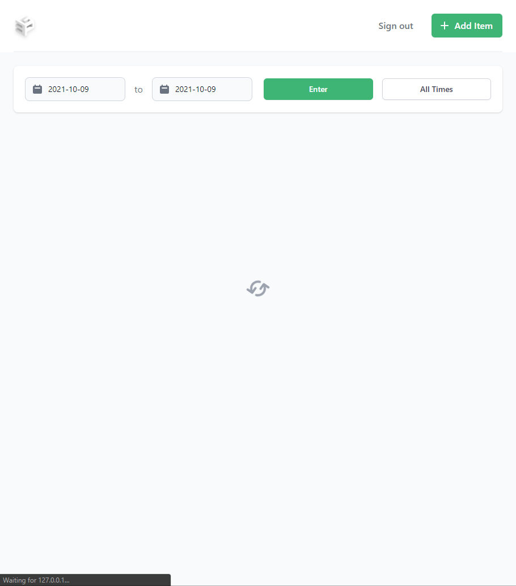
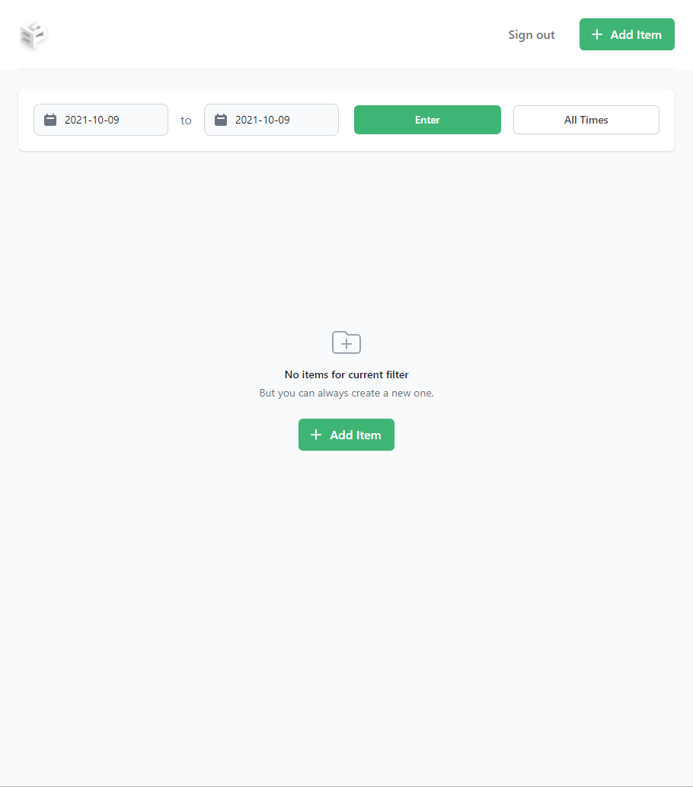

### Sort order of transactions

Transactions get their date recorded, not the precise time because it's much less valuable and reliable. Transactions of the same date are ordered with such rule when displayed:

1. Bigger amounts comes first
2. The type (income/expense) of the transaction does not matter
3. Transactions with notes are displayed first, sorted alphabetically descending

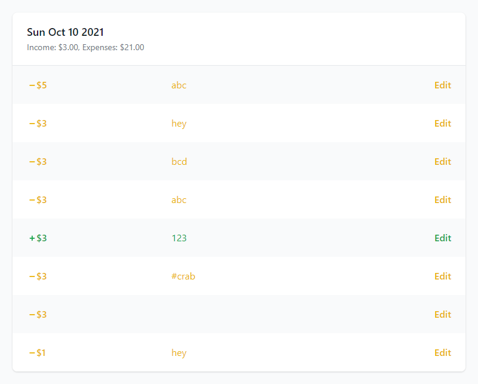
