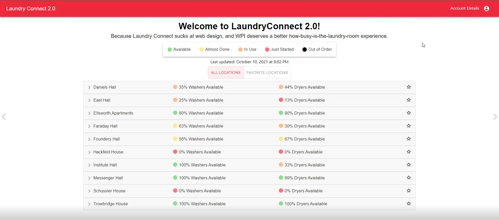

# LaundryConnect 2.0!

URL: https://laundry-connect-2.herokuapp.com/

This project is an improvement of the current LaundryConnect website. LaundryConnect is the service which provides data on the current progress of laundry machines at WPI; however, the website does not look great and it is hard to navigate (as shown below).

Our group decided we needed to improve the user interface and add functionality to save your favorite locations on campus.

These are some of the things we added:
- Added each laundry location with a drop down menu showing all machines and their availabilities
- Added a color code with five different colors showing the status of the machines
- Added an update time which shows when the page was last updated.
- Shows all washers and dryers with cards that show the machine's information.
  - Shows the time left if the machine is in use
  - Shows 'Avaliable' if the machine is available
  - Shows 'Ready for Pickup' if the cycle has finished
  - Shows 'Offline' if the machine is off or out of order
- Has a log-in feature with allows users to save their favorite locations
  - Users can hit the star icon to save their favorite locations and see them under the 'FAVORITE LOCATIONS' tab

**This is the original LaundryConnect**

**This is the new and improved version of LaundryConnect**

## Additional information needed to use the project

**Login**:
- *Username*: Admin
- *Password*: Admin

## Technologies used and how they were used

**MongoDB**: sadsf

**Node**: backend server and 

**React**: frontend framework based on components

**Mongoose**: SQL like structure to db

**Express**: login stuff

**Material UI**: prettify website/ accessibility

**Heroku**: put website on

**Session Storage**: store user logins 

## Technical Achievements

We fully implemented a new laundry system for WPI students. Due to our personal experience with using WPI's laundry service, we saw many problems with it and wanted to improve this. 

A technical achievement for this is implementing a webscraper to frequently retrieve data from the Laundry service and update the Mongo database with this data, then display this information with react on the website so users can see realtime updates of the current WPI laundry availability.

As a result of the achievements above, we created a better structured and better visualization of WPI's laundry system which is easier and more intuitive to use. Due to the nature of react and the Material UI components, this website is more accessible on mobile than the original LaundryConnect was.

Based on the feedback from the various students and professors, they were very appreciative of our reimplementation of WPI's laundry website.

## Challenges faced in this project

- Development of the webscraper
- Implementing the ability to favorite locations
- Updating the website anytime the database received data from the webscraper

## Group member contributions

**Andrew Kerekon**:
- Worked on frontend
  - Added UI flair
  - Persists user login on refresh
- Worked on the My Account Page
  - Implemented registration and login

**Owen McGinley**:
- Developed the webscraper for the laundry data
  - Hosted webscraper on personal server
  - Implented auto data fetching every two minutes
  - Pushed the webscraper data to mongo
- Worked on backend
- Did frontend UI touchups

**Steven Tran**:
- Worked on frontend
  - Formatted the login and register pages
  - Added UI flair to the design
  - Developed the user login and register UI
- Wrote the `readme` 

**Michael Zeolla**:
- Worked on backend
  - Implemented the favoriting feature
  - Implemented autorefreshing for the website
  - Deployed website on Heroku
- Worked on frontend
  - Built the basic structure of the website
  - Implemented the favoriting feature
  - Designed the basic UI for the website

**Duncan Soiffer**:
- Developed the website backend
  - Created user login, registration
  - Implemented the ability to get data from the Mongo server
  - Implemented Mongoose data structure

## Link to the video

